# Swift Message Bus - Technical Architecture Diagrams

## Table of Contents
1. [System Overview](#system-overview)
2. [Core Architecture](#core-architecture)
3. [Message Flow](#message-flow)
4. [Macro Compilation Pipeline](#macro-compilation-pipeline)
5. [Actor Concurrency Model](#actor-concurrency-model)
6. [CQRS/Event Sourcing Architecture](#cqrsevent-sourcing-architecture)
7. [Performance Architecture](#performance-architecture)
8. [Deployment Architecture](#deployment-architecture)

## System Overview

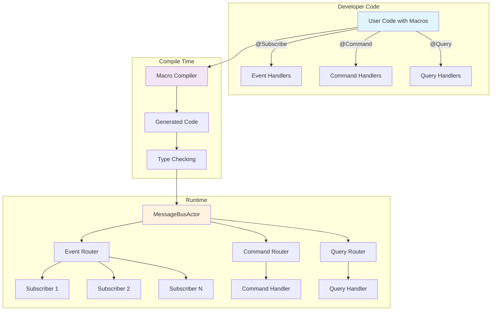

## Core Architecture

### Layered Architecture Design

```mermaid
graph TD
    subgraph "Application Layer"
        APP[Swift Application]
    end
    
    subgraph "Macro Layer"
        M1[@Subscribe Macro]
        M2[@Publish Macro]
        M3[@StateProjection Macro]
        M4[@WorkflowOrchestrator Macro]
        M5[40+ Other Macros]
    end
    
    subgraph "Core API Layer"
        API[Message Bus API]
        EVT[Event Protocol]
        CMD[Command Protocol]
        QRY[Query Protocol]
    end
    
    subgraph "Runtime Engine"
        ACTOR[MessageBusActor]
        ROUTER[Message Router]
        STORE[Event Store]
        PROJ[Projections]
    end
    
    subgraph "Platform Integration"
        SWIFT[Swift Concurrency]
        SWIFTUI[SwiftUI Bindings]
        COMBINE[Combine Bridge]
        UIKIT[UIKit Support]
    end
    
    APP --> M1
    APP --> M2
    APP --> M3
    APP --> M4
    APP --> M5
    
    M1 --> API
    M2 --> API
    M3 --> API
    M4 --> API
    M5 --> API
    
    API --> ACTOR
    ACTOR --> ROUTER
    ROUTER --> STORE
    ROUTER --> PROJ
    
    ACTOR --> SWIFT
    API --> SWIFTUI
    API --> COMBINE
    API --> UIKIT
    
    style APP fill:#e8f5e9
    style ACTOR fill:#fff9c4
    style API fill:#e3f2fd
```

## Message Flow

### Event Publishing Flow

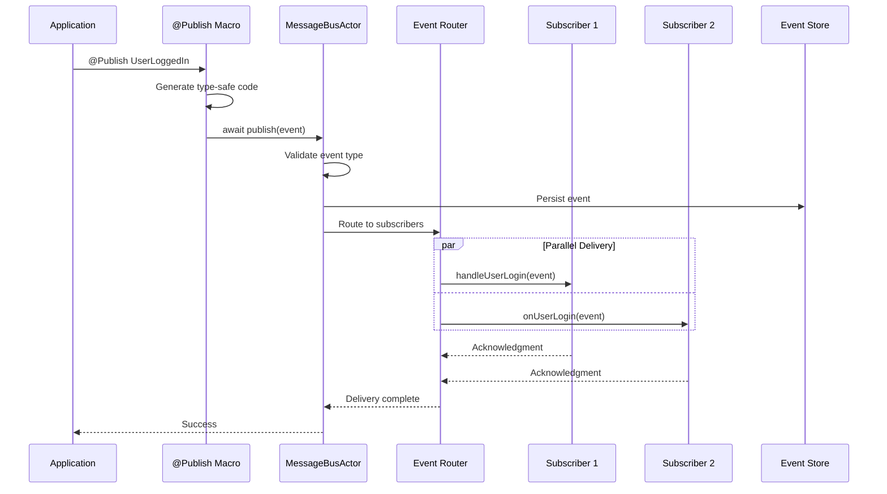

### Command Processing Flow

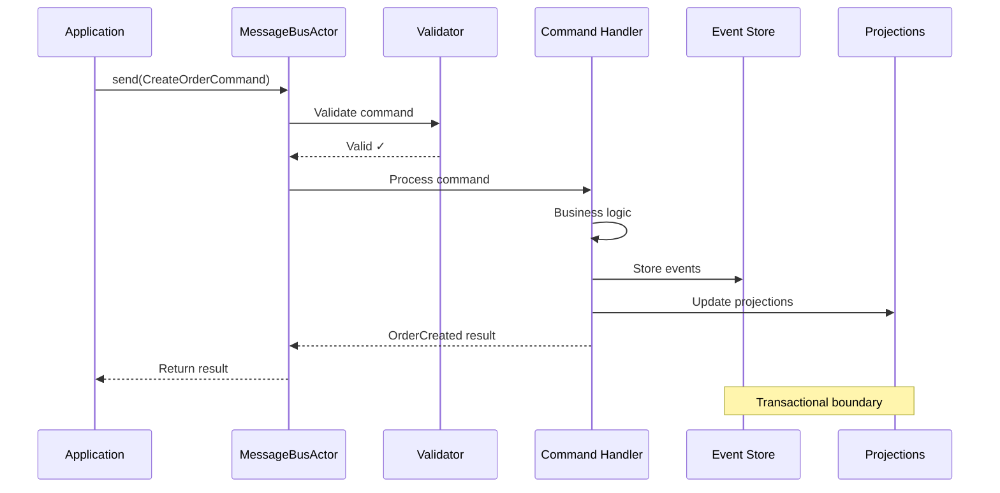

### Query Execution Flow

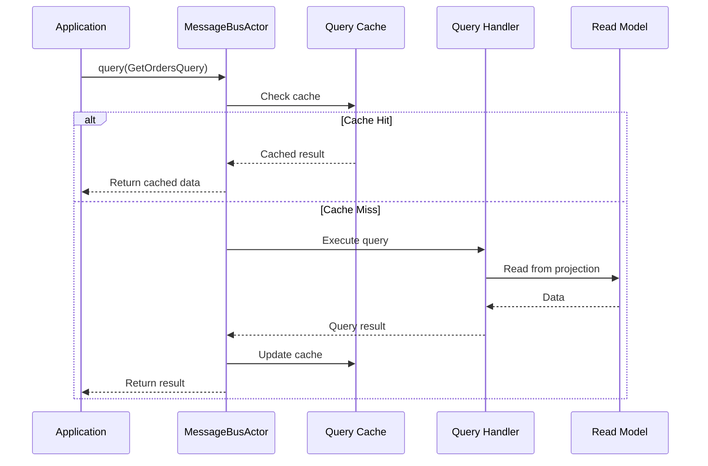

## Macro Compilation Pipeline

### Macro Expansion Process

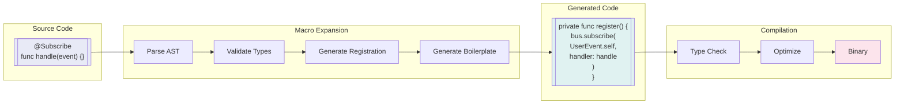

### Advanced Macro Generation

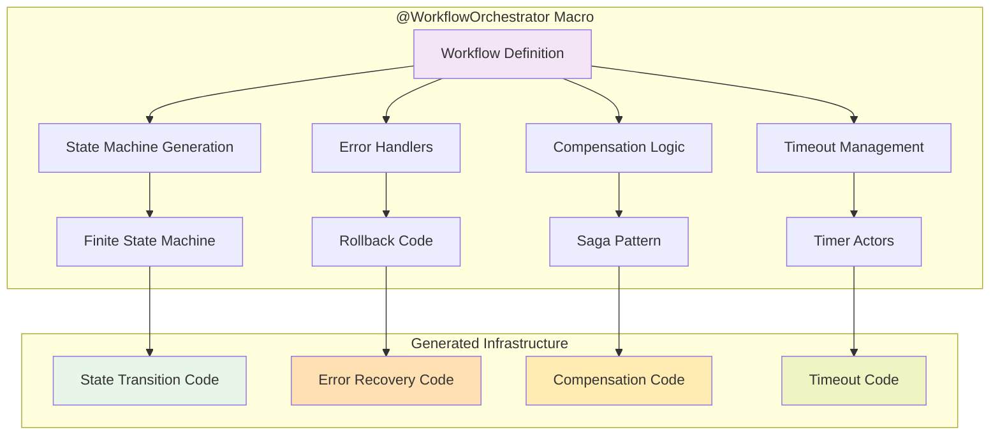

## Actor Concurrency Model

### Actor-Based Message Bus

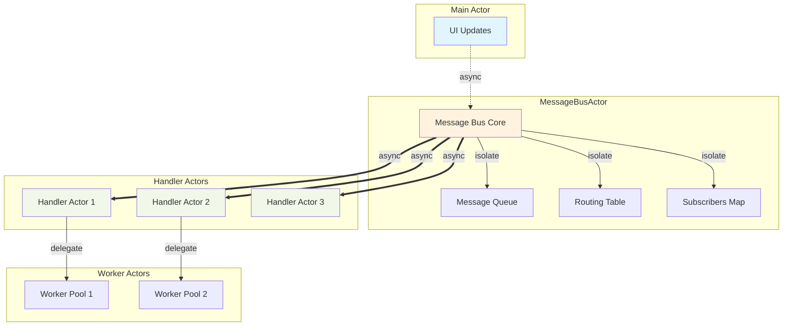

### Concurrency Safety Model

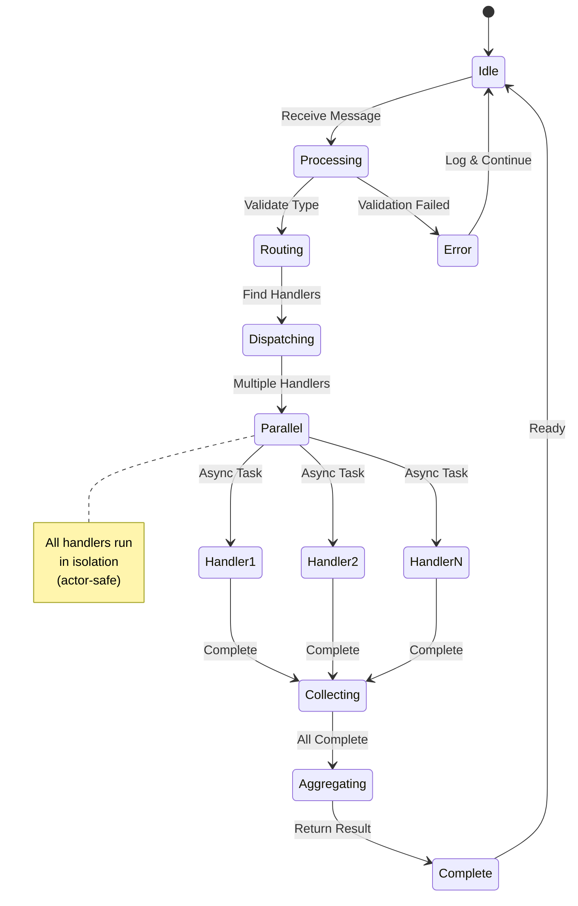

## CQRS/Event Sourcing Architecture

### CQRS Pattern Implementation

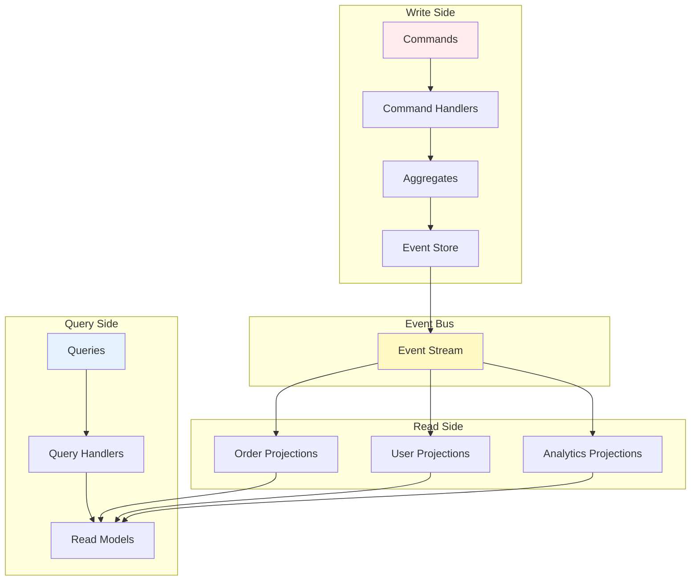

### Event Sourcing Flow

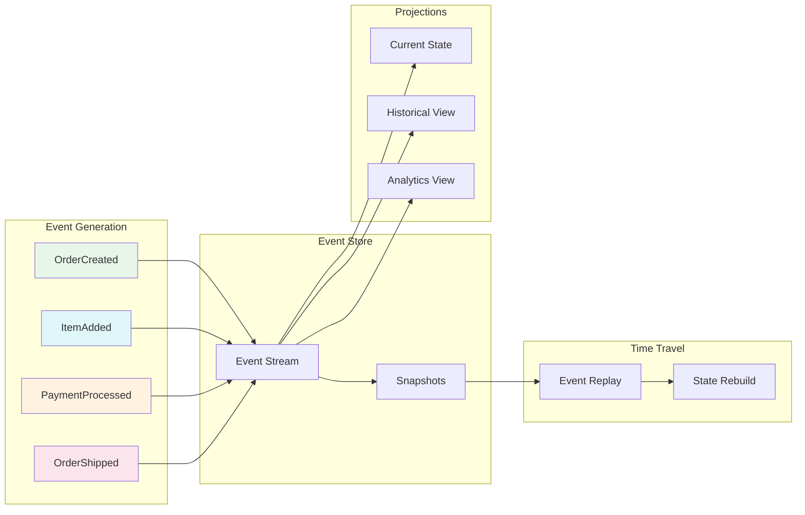

## Performance Architecture

### Message Processing Pipeline

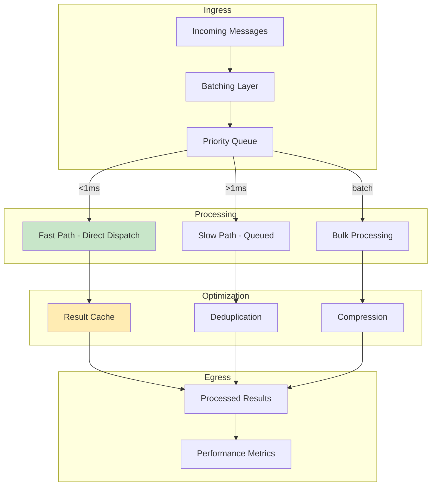

### Performance Monitoring

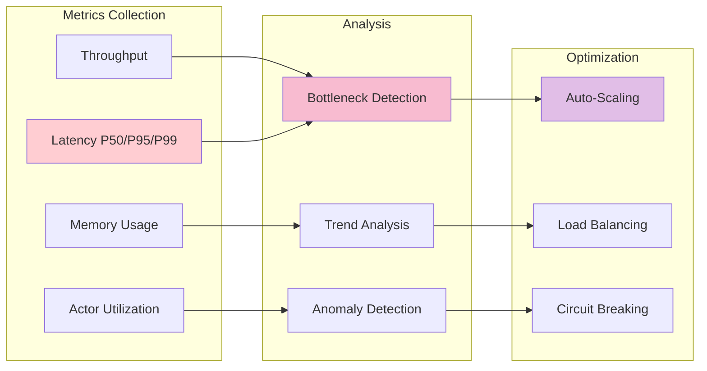

## Deployment Architecture

### Single Application Deployment

```mermaid
graph TB
    subgraph "iOS/macOS App"
        APP[Application]
        MB[Message Bus]
        STORE[Local Event Store]
    end
    
    subgraph "Features"
        F1[Feature Module 1]
        F2[Feature Module 2]
        F3[Feature Module 3]
    end
    
    APP --> MB
    MB --> STORE
    
    F1 -.->|@Subscribe| MB
    F2 -.->|@Subscribe| MB
    F3 -.->|@Subscribe| MB
    
    style APP fill:#e3f2fd
    style MB fill:#fff3e0
```

### Distributed System Deployment

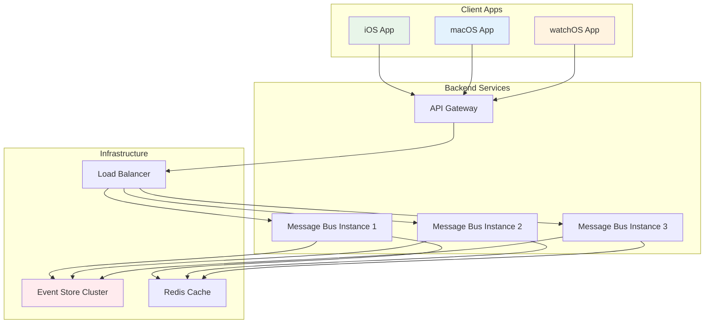

### Microservices Architecture

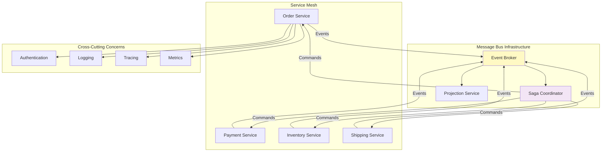

## Advanced Macro Architectures

### @StateProjection Architecture

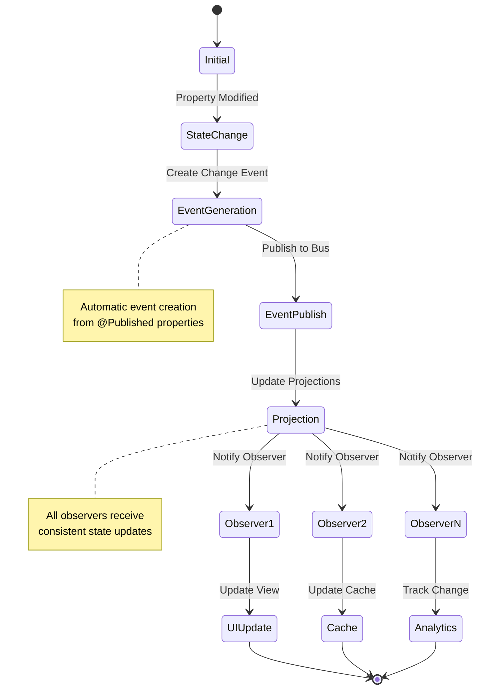

### @CircuitBreaker State Machine

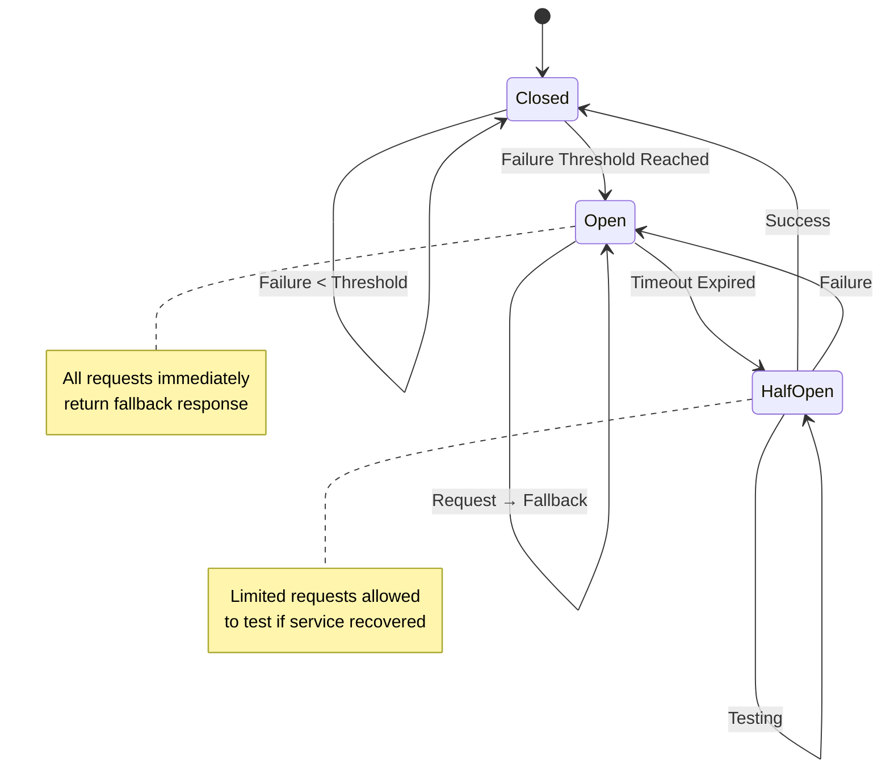

## Performance Benchmarks Architecture

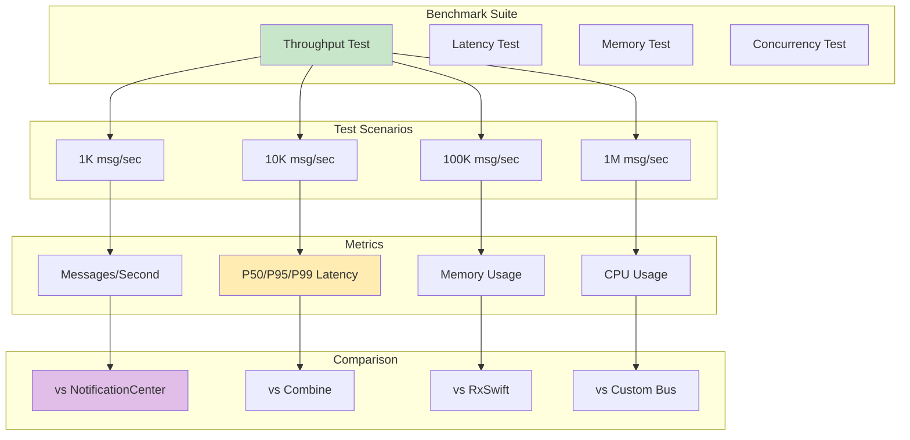

## Summary

These architectural diagrams illustrate the comprehensive design of the Swift Message Bus:

1. **Layered Architecture**: Clear separation between macros, API, runtime, and platform integration
2. **Actor-Based Concurrency**: Thread-safe by design with Swift actors
3. **CQRS/Event Sourcing**: Native support for modern architectural patterns
4. **Performance Pipeline**: Optimized for sub-millisecond latency
5. **Macro Compilation**: Compile-time code generation for zero-overhead abstractions
6. **Deployment Flexibility**: From single app to distributed microservices

The architecture prioritizes:
- **Type Safety**: Compile-time validation at every level
- **Performance**: Direct dispatch paths, minimal overhead
- **Scalability**: From simple apps to enterprise systems
- **Developer Experience**: Intuitive APIs powered by macros